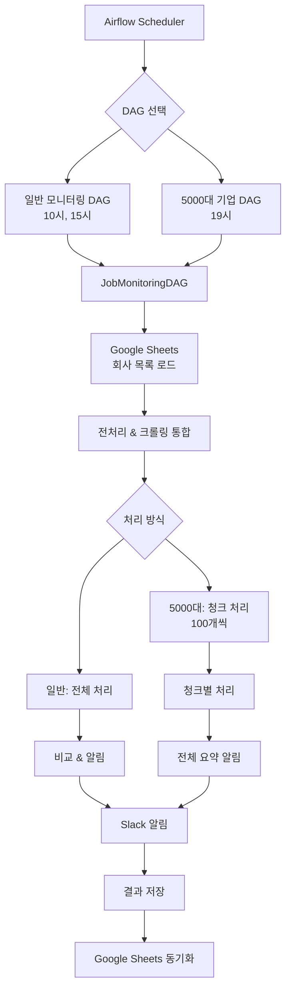

# Job Monitoring System
**기업 채용홈페이지 자동 모니터링 및 Slack 알림 시스템**

## 목차
- [시스템 개요](#시스템-개요)
- [시스템 아키텍처](#시스템-아키텍처)
- [동작 흐름도](#동작-흐름도)
- [프로젝트 구조](#프로젝트-구조)
- [핵심 기능](#핵심-기능)
- [설치 및 설정](#설치-및-설정)
- [운영 가이드](#운영-가이드)
- [기술 문서](#기술-문서)
- [문제해결](#문제해결)

## 시스템 개요

**Job Monitoring System**은 기업 채용홈페이지를 자동으로 모니터링하여 새로운 채용공고를 실시간으로 감지하고 Slack으로 알림을 보내는 완전 자동화 시스템입니다.

### 주요 특징
- **지능형 크롤링**: 동적/정적 웹사이트를 자동으로 구분하여 최적화된 방법으로 크롤링
- **패턴 기반 선택자 생성**: 채용공고 영역을 자동으로 감지하는 CSS 선택자 생성
- **대용량 처리**: 5000대 기업을 청크 단위로 안전하게 병렬 처리
- **실시간 알림**: 새로운 채용공고 발견 시 Slack으로 즉시 알림
- **웹 기반 관리**: Google Sheets를 통한 중앙화된 설정 관리

### 모니터링 대상
| 대상 | 실행 시간 | 처리 방식 | Slack 채널 |
|------|----------|----------|------------|
| **일반 채용홈페이지** | 매일 10시, 15시 | 전체 일괄 처리 | `SLACK_WEBHOOK_URL` |
| **5000대 기업** | 매일 19시 | 100개씩 청크 처리 | `TOP5000COMPANY_URL` |

## 시스템 아키텍처



## 동작 흐름도

### 1. 전체 시스템 흐름
```
Airflow 스케줄러
    ↓
JobMonitoringDAG 실행
    ↓
Google Sheets 데이터 로드
    ├─ 회사 목록 (URL, 설정)
    └─ 외국인 채용 키워드
    ↓
통합 전처리 & 크롤링
    ├─ Selenium 필요성 자동 판단
    ├─ CSS 선택자 자동 생성/재활용
    ├─ 병렬 HTML 수집 (3개 워커)
    └─ 채용공고 데이터 추출
    ↓
결과 비교 & 분석
    ├─ 새로운 채용공고 감지
    ├─ 외국인 채용공고 필터링
    └─ 의심스러운 변경사항 체크
    ↓
Slack 알림 발송
    ├─ 구조화된 메시지 (Block Kit)
    ├─ 회사별 그룹화
    ├─ 외국인 공고 하이라이트
    └─ 시간 정보 포함
    ↓
결과 저장 & 동기화
    ├─ CSV 파일 저장
    └─ Google Sheets 업데이트
```

### 2. 5000대 기업 청크 처리 흐름
```
5000대_기업 시트 로드
    ↓
100개씩 청크 분할
    ↓
각 청크별 처리 Loop
    ├─ 청크 N 처리 시작 로그
    ├─ 통합 전처리 & 크롤링
    ├─ 안전한 중간 저장 (Google Sheets)
    ├─ 실패 정보 수집 (알림 X)
    ├─ 2분 대기 (서버 부하 방지)
    └─ 다음 청크로 이동
    ↓
전체 처리 완료 후
    ├─ 모든 경고사항 수집
    ├─ 모든 실패 정보 수집
    └─ 요약 알림 한번에 발송
    ↓
최종 저장 & 동기화
```

### 3. 개별 회사 처리 상세 흐름
```
회사 정보 입력
    ├─ 회사명, URL, 기존 선택자
    └─ selenium_required 값
    ↓
Selenium 필요성 자동 판단
    ├─ SPA 프레임워크 감지
    ├─ JavaScript 의존도 분석
    └─ 특정 사이트 예외 처리
    ↓
HTML 콘텐츠 수집
    ├─ 정적: requests (빠른 처리)
    └─ 동적: Playwright (브라우저 자동화)
    ↓
CSS 선택자 처리
    ├─ 기존 검증된 선택자 재활용 (20자+ 우선)
    ├─ 새 선택자 자동 생성
    ├─ 채용공고 컨테이너 패턴 탐지
    └─ 가중치 기반 최적 선택자 선택
    ↓
채용공고 데이터 추출
    ├─ 선택자로 요소 추출
    ├─ 텍스트 정제 및 필터링
    ├─ 채용공고 유효성 검증
    └─ 외국인 채용 키워드 매칭
    ↓
결과 반환
    ├─ 성공: 채용공고 목록
    └─ 실패: 오류 정보 및 selenium_required 조정
```

## 상세 로직 흐름

### 1. 시스템 초기화 및 설정 로드

**JobMonitoringDAG 클래스 초기화:**
```python
# job_monitoring_logic.py:21-45
def __init__(self, base_dir, worksheet_name, webhook_url_env, results_filename):
    # 1. 환경변수 및 기본 설정 로드
    self.base_dir = base_dir  # 작업 디렉토리
    self.worksheet_name = worksheet_name  # 처리할 시트명
    self.webhook_url = os.getenv(webhook_url_env)  # 슬랙 웹훅 URL
    self.results_filename = results_filename  # 결과 저장 파일명

    # 2. Google Sheets 연동 관리자 초기화
    self.sheet_manager = GoogleSheetManager()

    # 3. 성능 설정 로드
    self.max_workers = int(os.getenv('MAX_WORKERS', 3))  # 병렬 처리 워커 수

    # 4. 로거 설정 (시간, 레벨, 메시지 포맷)
    self.logger = self._setup_logger()
```

**Google Sheets 연동 초기화:**
```python
# google_sheet_utils.py:15-30
class GoogleSheetManager:
    def __init__(self):
        # 1. 서비스 계정 인증 정보 로드
        self.credentials = service_account.Credentials.from_service_account_file(
            'key/credentials.json',
            scopes=['https://www.googleapis.com/auth/spreadsheets']
        )

        # 2. Google Sheets API 클라이언트 생성
        self.service = build('sheets', 'v4', credentials=self.credentials)

        # 3. 스프레드시트 ID 환경변수에서 로드
        self.spreadsheet_id = os.getenv('GOOGLE_SHEET_KEY')
```

### 2. 데이터 로드 및 전처리

**Google Sheets에서 회사 목록 로드:**
```python
# job_monitoring_logic.py:71-92
def run(self):
    # 1. 시트에서 회사 목록 데이터 로드
    df_config = self.sheet_manager.load_sheet_to_df(self.worksheet_name)

    # 2. 필수 컬럼 검증 (회사_한글_이름, job_posting_url)
    required_columns = ['회사_한글_이름', 'job_posting_url']
    if not all(col in df_config.columns for col in required_columns):
        raise ValueError(f"필수 컬럼 누락: {required_columns}")

    # 3. 빈 URL 제거 및 데이터 정제
    df_config = df_config.dropna(subset=['job_posting_url'])
    df_config = df_config[df_config['job_posting_url'].str.strip() != '']

    # 4. 외국인 채용 키워드 시트 로드
    keyword_sheets = ['5000대_기업', '[등록]채용홈페이지 모음']
    if self.worksheet_name in keyword_sheets:
        try:
            foreign_keywords_df = self.sheet_manager.load_sheet_to_df('외국인_키워드')
            self.foreign_keywords = foreign_keywords_df['키워드'].dropna().tolist()
        except:
            self.foreign_keywords = []  # 키워드 시트 없으면 빈 리스트
```

### 3. Selenium 필요성 자동 판단

**동적/정적 웹사이트 판단 로직:**
```python
# job_monitoring_logic.py:574-620
def _determine_selenium_requirement(self, url, company_name):
    """
    웹사이트 분석을 통한 크롤링 방식 자동 결정
    """
    try:
        # 1. 기본 HTML 헤더 요청으로 접근성 확인
        response = requests.head(url, timeout=10, allow_redirects=True)
        if response.status_code != 200:
            return -1  # 접근 불가

        # 2. HTML 콘텐츠 가져오기 시도
        html_response = requests.get(url, timeout=15, headers=HEADERS)
        if html_response.status_code != 200:
            return -1

        html_content = html_response.text

        # 3. SPA 프레임워크 감지
        spa_patterns = [
            r'react',           # React
            r'vue\.js',         # Vue.js
            r'angular',         # Angular
            r'next\.js',        # Next.js
            r'nuxt',            # Nuxt.js
            r'__NEXT_DATA__'    # Next.js 특정 패턴
        ]

        for pattern in spa_patterns:
            if re.search(pattern, html_content, re.IGNORECASE):
                self.logger.info(f"{company_name}: SPA 프레임워크 감지 - Selenium 필요")
                return 1

        # 4. JavaScript 의존도 분석
        js_indicators = [
            'document.addEventListener',
            'window.onload',
            'ajax',
            'fetch(',
            'XMLHttpRequest'
        ]

        js_count = sum(1 for indicator in js_indicators
                      if indicator in html_content)

        if js_count >= 3:  # 다중 JS 패턴 발견시
            return 1

        # 5. 특정 도메인 예외 처리
        domain_exceptions = {
            'workday.com': 1,      # 항상 동적
            'lever.co': 1,         # 항상 동적
            'greenhouse.io': 1,    # 항상 동적
            'notion.site': 1,      # Notion 페이지
        }

        parsed_url = urlparse(url)
        for domain, selenium_required in domain_exceptions.items():
            if domain in parsed_url.netloc:
                return selenium_required

        return 0  # 정적 사이트로 판단

    except Exception as e:
        self.logger.error(f"{company_name} Selenium 필요성 판단 실패: {e}")
        return -1
```

### 4. HTML 콘텐츠 수집

**동적/정적 방식 자동 선택:**
```python
# job_monitoring_logic.py:450-520
def get_html_content_for_crawling(self, url, selenium_required):
    """
    사이트 특성에 맞는 최적의 방법으로 HTML 수집
    """
    if selenium_required == 1:
        return self._get_html_with_playwright(url)
    else:
        return self._get_html_with_requests(url)

def _get_html_with_requests(self, url):
    """정적 사이트용 고속 HTML 수집"""
    try:
        # 1. 안전한 헤더 설정 (봇 차단 우회)
        headers = {
            'User-Agent': 'Mozilla/5.0 (Windows NT 10.0; Win64; x64) AppleWebKit/537.36',
            'Accept': 'text/html,application/xhtml+xml,application/xml;q=0.9,*/*;q=0.8',
            'Accept-Language': 'ko-KR,ko;q=0.8,en-US;q=0.5,en;q=0.3',
            'Accept-Encoding': 'gzip, deflate',
            'Connection': 'keep-alive',
        }

        # 2. 타임아웃과 재시도 설정
        response = requests.get(url, headers=headers, timeout=30)
        response.raise_for_status()

        return response.text, True

    except Exception as e:
        return None, False

def _get_html_with_playwright(self, url):
    """동적 사이트용 브라우저 자동화"""
    try:
        # 1. 브라우저 실행 (헤드리스 모드)
        with sync_playwright() as p:
            browser = p.chromium.launch(headless=True)
            page = browser.new_page()

            # 2. 브라우저 환경 설정
            page.set_viewport_size({"width": 1920, "height": 1080})
            page.set_extra_http_headers({
                "Accept-Language": "ko-KR,ko;q=0.9,en;q=0.8"
            })

            # 3. 페이지 로드 및 JS 실행 대기
            page.goto(url, wait_until='domcontentloaded', timeout=30000)

            # 4. 추가 렌더링 대기 (AJAX 로드 등)
            page.wait_for_timeout(2000)

            # 5. 최종 HTML 추출
            html_content = page.content()
            browser.close()

            return html_content, True

    except Exception as e:
        return None, False
```

### 5. CSS 선택자 생성 및 검증

**기존 선택자 재활용 우선 로직:**
```python
# job_monitoring_logic.py:290-340
def _process_company_complete(self, company_name, url, existing_selector):
    """
    선택자 찾기와 크롤링을 동시에 처리하는 통합 로직
    """
    # 1. 기존 검증된 선택자 재활용 체크
    if existing_selector and len(existing_selector.strip()) > 20:
        self.logger.info(f"{company_name}: 기존 검증된 선택자 재활용")

        # 기존 선택자로 크롤링 시도
        html_content, success = self.get_html_content_for_crawling(url, selenium_required)
        if success and html_content:
            job_postings = self._extract_job_postings_from_html(html_content, existing_selector)
            if len(job_postings) > 0:
                # 성공시 기존 선택자 그대로 사용
                return {
                    'selector': existing_selector,
                    'selenium_required': selenium_required,
                    'job_postings': job_postings
                }

    # 2. 새 선택자 생성 필요
    self.logger.info(f"{company_name}: 새 선택자 생성 중...")
    return self._generate_new_selector_and_crawl(company_name, url)
```

**새 CSS 선택자 자동 생성:**
```python
# analyze_titles.py:45-120
class JobPostingSelectorAnalyzer:
    def find_best_job_posting_selector(self, html_content):
        """
        HTML에서 최적의 채용공고 선택자를 찾는 메인 로직
        """
        soup = BeautifulSoup(html_content, 'html.parser')

        # 1. 채용공고 전용 컨테이너 우선 탐지
        job_containers = self._find_job_containers(soup)
        if job_containers:
            return self._analyze_job_container_patterns(job_containers)

        # 2. 일반적인 링크 패턴 분석
        all_links = soup.find_all('a', href=True)
        job_links = self._filter_job_related_links(all_links)

        if not job_links:
            return None

        # 3. 선택자 후보군 생성 및 평가
        selector_candidates = self._generate_selector_candidates(job_links)
        return self._evaluate_and_select_best(selector_candidates, soup)

    def _find_job_containers(self, soup):
        """채용공고 전용 컨테이너 탐지"""
        # 채용 관련 키워드 패턴
        job_keywords = [
            'job', 'career', 'recruit', 'employment', 'position',
            '채용', '모집', '구인', '입사', '직무'
        ]

        containers = []

        # class명과 id에서 채용 키워드 탐지
        for keyword in job_keywords:
            # 정확히 일치하거나 하이픈/언더스코어로 연결된 패턴
            pattern = f'(^|[^a-zA-Z]){keyword}([^a-zA-Z]|$)'

            class_matches = soup.find_all(attrs={'class': re.compile(pattern, re.I)})
            id_matches = soup.find_all(attrs={'id': re.compile(pattern, re.I)})

            containers.extend(class_matches + id_matches)

        return list(set(containers))  # 중복 제거

    def _filter_job_related_links(self, links):
        """직무 관련 링크만 필터링"""
        job_related_texts = [
            # 한글 직무명
            '개발자', '프로그래머', '엔지니어', '디자이너', '기획자',
            '마케터', '영업', '운영', '관리', '전문가', 'PM', 'PO',

            # 영문 직무명
            'developer', 'engineer', 'designer', 'manager', 'analyst',
            'specialist', 'coordinator', 'lead', 'senior', 'junior'
        ]

        filtered_links = []
        for link in links:
            text = link.get_text(strip=True).lower()

            # 직무 관련 텍스트 포함 여부 확인
            if any(keyword in text for keyword in job_related_texts):
                filtered_links.append(link)

        return filtered_links

    def _generate_selector_candidates(self, job_links):
        """선택자 후보군 생성"""
        candidates = {}

        for link in job_links:
            # 1. 클래스 기반 선택자
            if link.get('class'):
                class_selector = 'a.' + '.'.join(link['class'])
                candidates[class_selector] = candidates.get(class_selector, 0) + 1

            # 2. 부모 요소 기반 선택자
            parent = link.parent
            if parent and parent.get('class'):
                parent_selector = f".{'.'.join(parent['class'])} a"
                candidates[parent_selector] = candidates.get(parent_selector, 0) + 1

            # 3. 복합 선택자 (부모+자식)
            if parent and parent.parent:
                grandparent = parent.parent
                if grandparent.get('class'):
                    complex_selector = f".{'.'.join(grandparent['class'])} a"
                    candidates[complex_selector] = candidates.get(complex_selector, 0) + 1

        return candidates

    def _evaluate_and_select_best(self, candidates, soup):
        """가중치 기반 최적 선택자 선택"""
        scored_candidates = []

        for selector, count in candidates.items():
            try:
                # BeautifulSoup CSS 선택자로 테스트
                matches = soup.select(selector)

                # 점수 계산
                score = 0

                # 1. 매칭 개수 점수 (적당한 수가 좋음)
                if 3 <= len(matches) <= 50:
                    score += 30
                elif 1 <= len(matches) <= 2:
                    score += 20
                elif len(matches) > 50:
                    score += 10

                # 2. 선택자 구체성 점수
                if 'job' in selector.lower():
                    score += 25
                if 'career' in selector.lower():
                    score += 20
                if 'recruit' in selector.lower():
                    score += 20

                # 3. UI 요소 제외 (감점)
                ui_elements = ['nav', 'footer', 'header', 'menu', 'sidebar']
                if any(ui_elem in selector.lower() for ui_elem in ui_elements):
                    score -= 30

                # 4. 선택자 길이 점수 (너무 복잡하지 않게)
                if 10 <= len(selector) <= 50:
                    score += 15

                scored_candidates.append((selector, score, len(matches)))

            except Exception:
                continue  # 잘못된 선택자는 건너뛰기

        # 점수순 정렬하여 최고 점수 반환
        scored_candidates.sort(key=lambda x: x[1], reverse=True)

        return scored_candidates[0][0] if scored_candidates else None
```

### 6. 채용공고 데이터 추출 및 검증

**HTML에서 채용공고 추출:**
```python
# job_monitoring_logic.py:520-570
def _extract_job_postings_from_html(self, html_content, selector):
    """
    선택자를 사용하여 HTML에서 채용공고 추출
    """
    try:
        soup = BeautifulSoup(html_content, 'html.parser')

        # 1. CSS 선택자로 요소 추출
        elements = soup.select(selector)

        if not elements:
            return []

        job_postings = []
        seen_texts = set()  # 중복 제거용

        for element in elements:
            # 2. 텍스트 추출 및 정제
            text = element.get_text(strip=True)

            # 3. 기본 필터링
            if not text or len(text) < 2:
                continue

            # 4. 불필요한 텍스트 제거
            filtered_text = self._clean_job_posting_text(text)

            # 5. 중복 제거
            if filtered_text and filtered_text not in seen_texts:
                seen_texts.add(filtered_text)

                # 6. 채용공고 유효성 검증
                if self._is_valid_job_posting(filtered_text):
                    job_postings.append(filtered_text)

        return job_postings[:50]  # 최대 50개 제한

    except Exception as e:
        self.logger.error(f"채용공고 추출 오류: {e}")
        return []

def _clean_job_posting_text(self, text):
    """채용공고 텍스트 정제"""
    # 1. 날짜 패턴 제거
    text = re.sub(r'\d{4}[-./]\d{1,2}[-./]\d{1,2}', '', text)
    text = re.sub(r'\d{1,2}[-./]\d{1,2}[-./]\d{4}', '', text)

    # 2. 시간 패턴 제거
    text = re.sub(r'\d{1,2}:\d{2}', '', text)

    # 3. 불필요한 기호 정제
    text = re.sub(r'[^\w\s가-힣()]', ' ', text)
    text = ' '.join(text.split())  # 연속 공백 제거

    # 4. 길이 제한
    return text[:200] if text else None

def _is_valid_job_posting(self, text):
    """채용공고 유효성 검증"""
    # 1. 최소 길이 체크
    if len(text) < 3:
        return False

    # 2. 직무 관련 키워드 포함 여부
    job_keywords = [
        # 한글 직무
        '개발', '프로그래머', '엔지니어', '디자이너', '기획',
        '마케팅', '영업', '운영', '관리', '전문가',

        # 영문 직무
        'developer', 'engineer', 'designer', 'manager',
        'analyst', 'specialist', 'coordinator'
    ]

    text_lower = text.lower()
    has_job_keyword = any(keyword in text_lower for keyword in job_keywords)

    # 3. 제외할 텍스트 패턴
    exclude_patterns = [
        '로그인', '회원가입', '홈', '메뉴', '검색',
        'login', 'signup', 'home', 'menu', 'search',
        '이전', '다음', 'prev', 'next', '더보기', 'more'
    ]

    has_exclude = any(pattern in text_lower for pattern in exclude_patterns)

    return has_job_keyword and not has_exclude
```

### 7. 외국인 채용공고 키워드 매칭

**키워드 하이라이트 처리:**
```python
# job_monitoring_logic.py:780-830
def _highlight_foreign_keywords(self, job_posting):
    """
    외국인 채용공고 키워드를 하이라이트하고 감지 여부 반환
    """
    if not self.foreign_keywords:
        return job_posting, False

    highlighted_text = job_posting
    is_foreign = False

    for keyword in self.foreign_keywords:
        keyword = keyword.strip()
        if not keyword:
            continue

        # 1. 대소문자 무관 검색
        pattern = re.compile(re.escape(keyword), re.IGNORECASE)

        if pattern.search(job_posting):
            is_foreign = True

            # 2. 기존 볼드체와 중복 방지
            def replace_func(match):
                matched_text = match.group(0)
                # 이미 *로 둘러싸여 있는지 확인
                if highlighted_text[max(0, match.start()-1):match.start()] == '*' and \
                   highlighted_text[match.end():match.end()+1] == '*':
                    return matched_text  # 이미 볼드체면 그대로
                return f'*{matched_text}*'

            # 3. 키워드 하이라이트 적용
            highlighted_text = pattern.sub(replace_func, highlighted_text)

    return highlighted_text, is_foreign

def _is_foreign_job_posting(self, job_posting):
    """외국인 채용공고 여부만 확인 (하이라이트 없이)"""
    if not self.foreign_keywords:
        return False

    job_lower = job_posting.lower()
    return any(keyword.strip().lower() in job_lower
              for keyword in self.foreign_keywords if keyword.strip())
```

### 8. 결과 비교 및 새 공고 감지

**이전 결과와 비교 로직:**
```python
# job_monitoring_logic.py:690-750
def find_new_jobs(self, current_jobs, existing_jobs):
    """
    현재 크롤링 결과와 이전 결과를 비교하여 새 공고 감지
    """
    new_jobs = {}

    for company, current_job_list in current_jobs.items():
        if not current_job_list:
            continue

        # 1. 이전 결과 로드
        existing_job_list = existing_jobs.get(company, [])

        # 2. 새 공고 필터링 (집합 연산 사용)
        current_set = set(current_job_list)
        existing_set = set(existing_job_list)
        new_job_set = current_set - existing_set

        # 3. 새 공고가 있으면 결과에 추가
        if new_job_set:
            new_jobs[company] = list(new_job_set)
            self.logger.info(f"{company}: 새 공고 {len(new_job_set)}개 발견")

    return new_jobs

def check_suspicious_results(self, current_jobs, existing_jobs, new_jobs):
    """의심스러운 변경사항 감지"""
    warnings = []

    for company, current_job_list in current_jobs.items():
        existing_job_list = existing_jobs.get(company, [])

        # 1. 기존 공고가 많았는데 갑자기 없어진 경우
        if len(existing_job_list) >= 3 and len(current_job_list) == 0:
            warnings.append(f"{company}: 기존 {len(existing_job_list)}개 공고가 모두 사라짐")

        # 2. 공고 수가 급격히 변한 경우 (50% 이상 감소)
        elif len(existing_job_list) > 5:
            decrease_ratio = (len(existing_job_list) - len(current_job_list)) / len(existing_job_list)
            if decrease_ratio > 0.5:
                warnings.append(f"{company}: 공고 수 {decrease_ratio:.0%} 감소 ({len(existing_job_list)}→{len(current_job_list)})")

    return warnings
```

### 9. Slack 메시지 생성 및 전송

**구조화된 Block Kit 메시지 생성:**
```python
# job_monitoring_logic.py:894-951
def send_slack_notification(self, new_jobs, warnings, failed_companies, chunk_info=None):
    """
    Slack Block Kit을 활용한 구조화된 알림 메시지 전송
    """
    if new_jobs:
        total_new_jobs = sum(len(jobs) for jobs in new_jobs.values())
        foreign_job_count = sum(1 for jobs in new_jobs.values()
                               for job in jobs if self._is_foreign_job_posting(job))

        # 1. 메시지 헤더 생성
        chunk_str = f"({chunk_info}) " if chunk_info else ""
        foreign_info = f" (외국인 채용: {foreign_job_count}개 🔮)" if foreign_job_count > 0 else ""
        header_text = f"🎉 *새로운 채용공고 {total_new_jobs}개 발견!*{foreign_info} {chunk_str}({current_time})"

        # 2. 메시지 분할을 위한 초기화
        current_blocks = []
        current_blocks.append({"type": "section", "text": {"type": "mrkdwn", "text": header_text}})
        current_blocks.append({"type": "divider"})
        current_length = len(header_text) + 50  # 여유분 포함

        # 3. 회사별 채용공고 블록 생성
        for company, jobs in new_jobs.items():
            # 회사 URL 링크 처리
            company_url = self.company_urls.get(company, "")
            linked_company = f"<{company_url}|{company}>" if company_url else f"*{company}*"
            company_with_time = f"{linked_company} - {formatted_datetime}"

            # 채용공고 목록 생성
            job_lines = []
            for job in jobs:
                highlighted_job, is_foreign = self._highlight_foreign_keywords(job)
                job_line = f"• {highlighted_job}"
                if is_foreign:
                    job_line = f"🔮 {job_line}"
                job_lines.append(job_line)

            job_text = "\n".join(job_lines)
            company_section_text = f"📢 {company_with_time} - {len(jobs)}개\n{job_text}"

            # 4. 메시지 길이 체크 및 분할 처리
            estimated_length = current_length + len(company_section_text) + 100

            if estimated_length > CHAR_LIMIT:  # 2800자 초과시
                # 현재 블록들 먼저 전송
                payload = {"blocks": current_blocks, "username": "채용공고 알리미", "icon_emoji": ":robot_face:"}
                send_payload(payload)

                # 새 블록 시작 (계속 표시)
                current_blocks = []
                continuation_header = f"🎉 *새로운 채용공고 {total_new_jobs}개 발견!*{foreign_info} {chunk_str}({current_time}) - 계속"
                current_blocks.append({"type": "section", "text": {"type": "mrkdwn", "text": continuation_header}})
                current_blocks.append({"type": "divider"})
                current_length = len(continuation_header) + 50

            # 회사 섹션 추가
            company_section = {"type": "section", "text": {"type": "mrkdwn", "text": company_section_text}}
            current_blocks.append(company_section)
            current_length += len(company_section_text) + 100

        # 5. 마지막 블록들 전송
        if current_blocks:
            payload = {"blocks": current_blocks, "username": "채용공고 알리미", "icon_emoji": ":robot_face:"}
            send_payload(payload)
```

### 10. 데이터 저장 및 동기화

**결과 저장 및 Google Sheets 업데이트:**
```python
# job_monitoring_logic.py:750-780
def save_jobs(self, current_jobs):
    """크롤링 결과를 CSV 파일로 저장"""
    # 1. 저장할 데이터 구조 생성
    save_data = {}
    for company, jobs in current_jobs.items():
        save_data[company] = jobs if jobs else []

    # 2. JSON 형태로 CSV에 저장 (호환성)
    results_path = os.path.join(self.base_dir, 'data', self.results_filename)
    os.makedirs(os.path.dirname(results_path), exist_ok=True)

    # 3. DataFrame으로 변환하여 저장
    df_results = pd.DataFrame([
        {'company': company, 'jobs': json.dumps(jobs, ensure_ascii=False)}
        for company, jobs in save_data.items()
    ])

    df_results.to_csv(results_path, index=False, encoding='utf-8-sig')
    self.logger.info(f"결과 저장 완료: {results_path}")

# Google Sheets 동기화
# google_sheet_utils.py:80-120
def update_sheet_from_df(self, df, worksheet_name):
    """DataFrame을 Google Sheets에 안전하게 업데이트"""
    try:
        # 1. 헤더 보존을 위한 기존 시트 구조 확인
        range_name = f'{worksheet_name}!1:1'
        existing_headers = self.service.spreadsheets().values().get(
            spreadsheetId=self.spreadsheet_id,
            range=range_name
        ).execute()

        # 2. 데이터를 2차원 배열로 변환
        values = [df.columns.tolist()]  # 헤더
        for _, row in df.iterrows():
            values.append(row.tolist())

        # 3. 전체 시트 클리어 후 새 데이터 입력
        clear_range = f'{worksheet_name}!A:Z'
        self.service.spreadsheets().values().clear(
            spreadsheetId=self.spreadsheet_id,
            range=clear_range
        ).execute()

        # 4. 새 데이터 배치 업데이트
        body = {'values': values}
        self.service.spreadsheets().values().update(
            spreadsheetId=self.spreadsheet_id,
            range=f'{worksheet_name}!A1',
            valueInputOption='RAW',
            body=body
        ).execute()

        self.logger.info(f"Google Sheets 업데이트 완료: {len(df)}개 행")

    except Exception as e:
        self.logger.error(f"Google Sheets 업데이트 실패: {e}")
        raise
```

## 프로젝트 구조

```
job-monitoring/
├── src/                              # 핵심 소스코드 (5개 파일)
│   ├── job_monitoring_logic.py       # 메인 크롤링 로직 (979줄)
│   ├── job_monitoring_airflow_dag.py # Airflow 스케줄링 정의
│   ├── analyze_titles.py             # 선택자 패턴 분석기 (729줄)
│   ├── google_sheet_utils.py         # Google Sheets 연동
│   └── utils.py                      # 유틸리티 함수들
├── data/                             # 데이터 저장소
│   ├── job_postings_latest.csv       # 일반 모니터링 결과
│   └── top_5000_postings_latest.csv  # 5000대 기업 결과
├── logs/                             # Airflow 실행 로그
│   ├── dag_id=job_monitoring_dag/
│   ├── dag_id=top5000_company_monitoring_dag/
│   └── scheduler/
├── key/                              # 인증 파일
│   └── credentials.json              # Google API 서비스 계정 키
├── scripts/                          # 배포 자동화
│   ├── lambda_function.py            # AWS Lambda 함수
│   └── setup-aws-automation.sh       # AWS 환경 설정
├── archive_temp/                     # 디버깅 스크립트 보관소
├── docker-compose.yml                # Docker 컨테이너 설정
├── Dockerfile                        # Docker 이미지 정의
├── requirements.txt                  # Python 의존성
└── .env                              # 환경변수 설정
```

## 핵심 기능

### 1. 지능형 웹사이트 분석

**동적/정적 웹사이트 자동 구분:**
- SPA(React, Vue, Next.js) 프레임워크 자동 감지
- JavaScript 의존도 분석으로 렌더링 방식 결정
- requests 실패 시 Playwright로 자동 전환
- 사이트별 맞춤 최적화 로직

**CSS 선택자 자동 생성:**
- 기존 검증된 선택자 재활용 우선 (20자 이상)
- 채용공고 컨테이너 패턴 인식 (job, recruit, career)
- 가중치 기반 최적 선택자 선택
- UI 요소 제외 필터 (네비게이션, 푸터, 광고)

### 2. 고성능 병렬 처리

**멀티스레드 크롤링:**
- ThreadPoolExecutor 기반 병렬 처리 (기본 3개 워커)
- Selenium 필요성 판단과 크롤링 동시 병렬화
- 청크 단위 처리로 메모리 효율성 확보

**안전한 대용량 처리:**
- 5000대 기업을 100개씩 청크 분할
- 청크 간 2분 대기로 서버 부하 방지
- 중간 실패 시에도 처리 계속 및 복구

### 3. 스마트 알림 시스템

**외국인 채용공고 필터링:**
- Google Sheets 기반 키워드 관리
- 실시간 키워드 하이라이트 (`*키워드*`)
- 기존 볼드체와의 중복 방지 로직
- 이모지로 시각적 구분

**구조화된 Slack 메시지:**
- Block Kit 기반 가독성 높은 메시지
- 회사명 클릭 시 채용 페이지 이동
- 한국 시간 기준 상세 시간 정보
- 실패 원인과 해결 방법 안내

### 4. 데이터 관리 및 모니터링

**Google Sheets 중앙 관리:**
- 웹 기반 회사 정보 관리
- 실시간 설정 변경 반영
- 헤더 보존 안전한 업데이트
- 대용량 데이터 배치 처리

**결과 추적 및 분석:**
- 이전 결과와 자동 비교
- 의심스러운 변경사항 감지 (기존 공고 모두 사라진 경우)
- CSV 기반 이력 관리
- 성과 로그 자동 기록

## 설치 및 설정

### 1. 시스템 요구사항
```bash
# Python 3.8+ 필수
python --version  # 3.8 이상 확인

# Docker & Docker Compose
docker --version
docker-compose --version
```

### 2. 프로젝트 설정
```bash
# 1. 저장소 클론
git clone https://github.com/your-repo/kowork-scaper.git
cd kowork-scaper

# 2. 환경변수 설정
cp .env.example .env
# .env 파일 편집하여 실제 값 입력
```

### 3. 환경변수 설정 (.env)
```env
# Airflow 설정
AIRFLOW_UID=50000

# Google Sheets API
GOOGLE_SHEET_KEY=your_sheet_key_here

# Slack Webhook URLs
SLACK_WEBHOOK_URL=https://hooks.slack.com/services/YOUR_WEBHOOK
TOP5000COMPANY_URL=https://hooks.slack.com/services/YOUR_TOP5000_WEBHOOK

# 성능 설정
MAX_WORKERS=3  # 병렬 처리 워커 수
```

### 4. Google API 설정
1. [Google Cloud Console](https://console.cloud.google.com/)에서 새 프로젝트 생성
2. Google Sheets API 활성화
3. 서비스 계정 생성 및 JSON 키 다운로드
4. 키 파일을 `key/credentials.json`에 저장
5. 서비스 계정 이메일을 Google Sheets에 편집자로 추가

### 5. Docker 실행
```bash
# 컨테이너 빌드 및 실행
docker-compose up -d

# 실행 상태 확인
docker-compose ps

# 웹 UI 접속: http://localhost:8080
# 기본 계정: admin / admin
```

## 운영 가이드

### 일상 운영 체크리스트

**시스템 상태 확인:**
```bash
# 컨테이너 상태
docker-compose ps

# 실시간 로그 모니터링
docker-compose logs -f webserver scheduler

# 디스크 사용량
du -sh data/ logs/
```

**DAG 관리 (Airflow Web UI):**
- DAG 실행 상태: Success/Failed/Running 확인
- 실행 시간 모니터링: 일반 30분, 5000대 기업 2시간 이내
- 수동 실행 시: `Trigger DAG` 버튼 사용

### Google Sheets 설정 관리

**시트 구조:**
| 컬럼명 | 설명 | 예시 |
|--------|------|------|
| `회사_한글_이름` | 회사명 | `삼성전자` |
| `job_posting_url` | 채용 페이지 URL | `https://company.com/careers` |
| `selector` | CSS 선택자 (자동생성) | `div.job-list a.job-title` |
| `selenium_required` | 크롤링 방식 | `0`: requests, `1`: Selenium, `-1`: 실패 |

**새 회사 추가 방법:**
1. Google Sheets에서 새 행 추가
2. `회사_한글_이름`과 `job_posting_url`만 입력
3. `selector`와 `selenium_required`는 빈 값으로 두기 (자동 생성)
4. 다음 실행 시 자동으로 값 설정됨

### 문제 상황별 대응

**`selenium_required` 값 의미:**
- `0`: requests 방식으로 정상 크롤링 가능
- `1`: Selenium 브라우저 자동화 필요 (SPA 사이트)
- `-1`: HTML 가져오기 실패 (접근 차단, 네트워크 오류)
- `-2`: 선택자 생성 실패 (채용공고 영역 찾을 수 없음)

**문제 해결 단계:**
1. **`-1` 오류**: URL 유효성 확인, 사이트 접근성 체크
2. **`-2` 오류**: 사이트 구조 변경 확인, 수동 선택자 입력 고려
3. **중복/누락**: 해당 회사 `selector` 값 삭제하여 재생성 유도

## 기술 문서

### 핵심 클래스 상세 설명

#### JobMonitoringDAG 클래스
**역할**: 전체 모니터링 프로세스 관리 및 조율

**주요 메서드:**
- `run()`: 메인 실행 로직, DAG별 처리 방식 분기
- `process_companies_integrated()`: 전처리와 크롤링을 통합한 고효율 처리
- `_process_company_complete()`: 개별 회사의 선택자 찾기와 크롤링을 동시 처리
- `get_html_content_for_crawling()`: Playwright/requests 방식을 자동 선택하여 HTML 수집
- `send_slack_notification()`: 외국인 키워드 하이라이트 포함 구조화된 알림 발송

#### JobPostingSelectorAnalyzer 클래스
**역할**: 채용공고 영역 자동 탐지 및 CSS 선택자 생성

**패턴 분석 알고리즘:**
1. 채용공고 전용 컨테이너 우선 탐지 (job, recruit, career 키워드)
2. 직무 관련 텍스트 필터링 (개발자, 엔지니어, 디자이너 등)
3. UI 요소 제외 (네비게이션, 푸터, 날짜 등)
4. 가중치 기반 선택자 품질 평가

#### GoogleSheetManager 클래스
**역할**: Google Sheets와의 실시간 데이터 동기화

**동기화 전략:**
- 서비스 계정 기반 안전한 인증
- 헤더 보존하면서 데이터만 업데이트
- 대용량 데이터 배치 처리 최적화

### 성능 최적화 설정

**병렬 처리 조정:**
```python
# .env 파일
MAX_WORKERS=3  # CPU 코어 수에 맞춰 조정 (권장: 2-4)
```

**청크 크기 조정:**
```python
# src/job_monitoring_logic.py 106라인
chunk_size = 100  # 메모리와 안정성 고려하여 50-150 범위에서 조정
```

**대기 시간 조정:**
```python
# src/job_monitoring_logic.py 145라인
time.sleep(120)  # 서버 부하에 따라 60-300초 범위에서 조정
```

## 문제해결

### 자주 발생하는 문제

#### Docker 관련 문제
```bash
# 컨테이너 재시작
docker-compose down
docker-compose up -d --build

# 포트 충돌 해결
lsof -i :8080  # 사용 중인 프로세스 확인
```

#### 크롤링 관련 문제
- **접근 차단**: User-Agent 변경, 요청 간격 증가
- **선택자 실패**: 사이트 구조 변경 확인, Google Sheets에서 selector 값 삭제
- **성능 저하**: MAX_WORKERS 감소, chunk_size 조정

#### Google Sheets 연동 문제
```bash
# 인증 오류
ls -la key/credentials.json  # 파일 존재 확인
# Google Cloud Console에서 서비스 계정 권한 확인

# API 할당량 초과
# Google Cloud Console -> APIs & Services -> Quotas에서 확인
```

---

**시스템 버전**: v2.5.0
**문서 업데이트**: 2024년 9월 25일
**유지보수**: 리팩토링 완료, 핵심 기능만 유지
