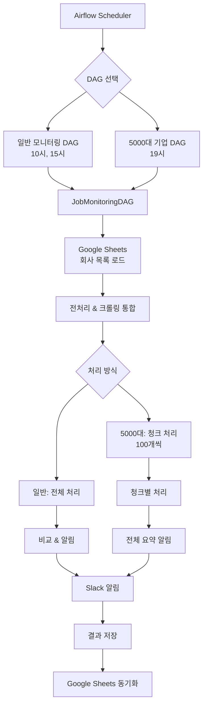

# Job Monitoring System
**기업 채용홈페이지 자동 모니터링 및 Slack 알림 시스템**

## 목차
- [시스템 개요](#시스템-개요)
- [시스템 아키텍처](#시스템-아키텍처)
- [동작 흐름도](#동작-흐름도)
- [프로젝트 구조](#프로젝트-구조)
- [핵심 기능](#핵심-기능)
- [설치 및 설정](#설치-및-설정)
- [운영 가이드](#운영-가이드)
- [기술 문서](#기술-문서)
- [문제해결](#문제해결)

## 시스템 개요

**Job Monitoring System**은 기업 채용홈페이지를 자동으로 모니터링하여 새로운 채용공고를 실시간으로 감지하고 Slack으로 알림을 보내는 완전 자동화 시스템입니다.

### 주요 특징
- **지능형 크롤링**: 동적/정적 웹사이트를 자동으로 구분하여 최적화된 방법으로 크롤링
- **패턴 기반 선택자 생성**: 채용공고 영역을 자동으로 감지하는 CSS 선택자 생성
- **대용량 처리**: 5000대 기업을 청크 단위로 안전하게 병렬 처리
- **실시간 알림**: 새로운 채용공고 발견 시 Slack으로 즉시 알림
- **웹 기반 관리**: Google Sheets를 통한 중앙화된 설정 관리

### 모니터링 대상
| 대상 | 실행 시간 | 처리 방식 | Slack 채널 |
|------|----------|----------|------------|
| **일반 채용홈페이지** | 매일 10시, 15시 | 전체 일괄 처리 | `SLACK_WEBHOOK_URL` |
| **5000대 기업** | 매일 19시 | 100개씩 청크 처리 | `TOP5000COMPANY_URL` |

## 시스템 아키텍처



## 동작 흐름도

### 1. 전체 시스템 흐름
```
📅 Airflow 스케줄러
    ↓
🔄 JobMonitoringDAG 실행
    ↓
📊 Google Sheets 데이터 로드
    ├─ 회사 목록 (URL, 설정)
    └─ 외국인 채용 키워드
    ↓
🔍 통합 전처리 & 크롤링
    ├─ Selenium 필요성 자동 판단
    ├─ CSS 선택자 자동 생성/재활용
    ├─ 병렬 HTML 수집 (3개 워커)
    └─ 채용공고 데이터 추출
    ↓
📋 결과 비교 & 분석
    ├─ 새로운 채용공고 감지
    ├─ 외국인 채용공고 필터링
    └─ 의심스러운 변경사항 체크
    ↓
📤 Slack 알림 발송
    ├─ 구조화된 메시지 (Block Kit)
    ├─ 회사별 그룹화
    ├─ 외국인 공고 하이라이트
    └─ 시간 정보 포함
    ↓
💾 결과 저장 & 동기화
    ├─ CSV 파일 저장
    └─ Google Sheets 업데이트
```

### 2. 5000대 기업 청크 처리 흐름
```
📊 5000대_기업 시트 로드
    ↓
✂️ 100개씩 청크 분할
    ↓
🔄 각 청크별 처리 Loop
    ├─ 청크 N 처리 시작 로그
    ├─ 통합 전처리 & 크롤링
    ├─ 안전한 중간 저장 (Google Sheets)
    ├─ 실패 정보 수집 (알림 X)
    ├─ 2분 대기 (서버 부하 방지)
    └─ 다음 청크로 이동
    ↓
📋 전체 처리 완료 후
    ├─ 모든 경고사항 수집
    ├─ 모든 실패 정보 수집
    └─ 요약 알림 한번에 발송
    ↓
💾 최종 저장 & 동기화
```

### 3. 개별 회사 처리 상세 흐름
```
🏢 회사 정보 입력
    ├─ 회사명, URL, 기존 선택자
    └─ selenium_required 값
    ↓
🔍 Selenium 필요성 자동 판단
    ├─ SPA 프레임워크 감지
    ├─ JavaScript 의존도 분석
    └─ 특정 사이트 예외 처리
    ↓
🌐 HTML 콘텐츠 수집
    ├─ 정적: requests (빠른 처리)
    └─ 동적: Playwright (브라우저 자동화)
    ↓
🎯 CSS 선택자 처리
    ├─ 기존 검증된 선택자 재활용 (20자+ 우선)
    ├─ 새 선택자 자동 생성
    ├─ 채용공고 컨테이너 패턴 탐지
    └─ 가중치 기반 최적 선택자 선택
    ↓
📄 채용공고 데이터 추출
    ├─ 선택자로 요소 추출
    ├─ 텍스트 정제 및 필터링
    ├─ 채용공고 유효성 검증
    └─ 외국인 채용 키워드 매칭
    ↓
✅ 결과 반환
    ├─ 성공: 채용공고 목록
    └─ 실패: 오류 정보 및 selenium_required 조정
```

## 프로젝트 구조

```
job-monitoring/
├── src/                              # 핵심 소스코드 (5개 파일)
│   ├── job_monitoring_logic.py       # 메인 크롤링 로직 (979줄)
│   ├── job_monitoring_airflow_dag.py # Airflow 스케줄링 정의
│   ├── analyze_titles.py             # 선택자 패턴 분석기 (729줄)
│   ├── google_sheet_utils.py         # Google Sheets 연동
│   └── utils.py                      # 유틸리티 함수들
├── data/                             # 데이터 저장소
│   ├── job_postings_latest.csv       # 일반 모니터링 결과
│   ├── top_5000_postings_latest.csv  # 5000대 기업 결과
│   └── 성과.txt                      # 작업 성과 기록
├── logs/                             # Airflow 실행 로그
│   ├── dag_id=job_monitoring_dag/
│   ├── dag_id=top5000_company_monitoring_dag/
│   └── scheduler/
├── key/                              # 인증 파일
│   └── credentials.json              # Google API 서비스 계정 키
├── scripts/                          # 배포 자동화
│   ├── lambda_function.py            # AWS Lambda 함수
│   └── setup-aws-automation.sh       # AWS 환경 설정
├── archive_temp/                     # 디버깅 스크립트 보관소
├── docker-compose.yml                # Docker 컨테이너 설정
├── Dockerfile                        # Docker 이미지 정의
├── requirements.txt                  # Python 의존성
└── .env                              # 환경변수 설정
```

## 핵심 기능

### 1. 지능형 웹사이트 분석

**동적/정적 웹사이트 자동 구분:**
- SPA(React, Vue, Next.js) 프레임워크 자동 감지
- JavaScript 의존도 분석으로 렌더링 방식 결정
- requests 실패 시 Playwright로 자동 전환
- 사이트별 맞춤 최적화 로직

**CSS 선택자 자동 생성:**
- 기존 검증된 선택자 재활용 우선 (20자 이상)
- 채용공고 컨테이너 패턴 인식 (job, recruit, career)
- 가중치 기반 최적 선택자 선택
- UI 요소 제외 필터 (네비게이션, 푸터, 광고)

### 2. 고성능 병렬 처리

**멀티스레드 크롤링:**
- ThreadPoolExecutor 기반 병렬 처리 (기본 3개 워커)
- Selenium 필요성 판단과 크롤링 동시 병렬화
- 청크 단위 처리로 메모리 효율성 확보

**안전한 대용량 처리:**
- 5000대 기업을 100개씩 청크 분할
- 청크 간 2분 대기로 서버 부하 방지
- 중간 실패 시에도 처리 계속 및 복구

### 3. 스마트 알림 시스템

**외국인 채용공고 필터링:**
- Google Sheets 기반 키워드 관리
- 실시간 키워드 하이라이트 (`*키워드*`)
- 기존 볼드체와의 중복 방지 로직
- 🔮 이모지로 시각적 구분

**구조화된 Slack 메시지:**
- Block Kit 기반 가독성 높은 메시지
- 회사명 클릭 시 채용 페이지 이동
- 한국 시간 기준 상세 시간 정보
- 실패 원인과 해결 방법 안내

### 4. 데이터 관리 및 모니터링

**Google Sheets 중앙 관리:**
- 웹 기반 회사 정보 관리
- 실시간 설정 변경 반영
- 헤더 보존 안전한 업데이트
- 대용량 데이터 배치 처리

**결과 추적 및 분석:**
- 이전 결과와 자동 비교
- 의심스러운 변경사항 감지 (기존 공고 모두 사라진 경우)
- CSV 기반 이력 관리
- 성과 로그 자동 기록

## 설치 및 설정

### 1. 시스템 요구사항
```bash
# Python 3.8+ 필수
python --version  # 3.8 이상 확인

# Docker & Docker Compose
docker --version
docker-compose --version
```

### 2. 프로젝트 설정
```bash
# 1. 저장소 클론
git clone https://github.com/your-repo/kowork-scaper.git
cd kowork-scaper

# 2. 환경변수 설정
cp .env.example .env
# .env 파일 편집하여 실제 값 입력
```

### 3. 환경변수 설정 (.env)
```env
# Airflow 설정
AIRFLOW_UID=50000

# Google Sheets API
GOOGLE_SHEET_KEY=your_sheet_key_here

# Slack Webhook URLs
SLACK_WEBHOOK_URL=https://hooks.slack.com/services/YOUR_WEBHOOK
TOP5000COMPANY_URL=https://hooks.slack.com/services/YOUR_TOP5000_WEBHOOK

# 성능 설정
MAX_WORKERS=3  # 병렬 처리 워커 수
```

### 4. Google API 설정
1. [Google Cloud Console](https://console.cloud.google.com/)에서 새 프로젝트 생성
2. Google Sheets API 활성화
3. 서비스 계정 생성 및 JSON 키 다운로드
4. 키 파일을 `key/credentials.json`에 저장
5. 서비스 계정 이메일을 Google Sheets에 편집자로 추가

### 5. Docker 실행
```bash
# 컨테이너 빌드 및 실행
docker-compose up -d

# 실행 상태 확인
docker-compose ps

# 웹 UI 접속: http://localhost:8080
# 기본 계정: admin / admin
```

## 운영 가이드

### 일상 운영 체크리스트

**시스템 상태 확인:**
```bash
# 컨테이너 상태
docker-compose ps

# 실시간 로그 모니터링
docker-compose logs -f webserver scheduler

# 디스크 사용량
du -sh data/ logs/
```

**DAG 관리 (Airflow Web UI):**
- DAG 실행 상태: Success/Failed/Running 확인
- 실행 시간 모니터링: 일반 30분, 5000대 기업 2시간 이내
- 수동 실행 시: `Trigger DAG` 버튼 사용

### Google Sheets 설정 관리

**시트 구조:**
| 컬럼명 | 설명 | 예시 |
|--------|------|------|
| `회사_한글_이름` | 회사명 | `삼성전자` |
| `job_posting_url` | 채용 페이지 URL | `https://company.com/careers` |
| `selector` | CSS 선택자 (자동생성) | `div.job-list a.job-title` |
| `selenium_required` | 크롤링 방식 | `0`: requests, `1`: Selenium, `-1`: 실패 |

**새 회사 추가 방법:**
1. Google Sheets에서 새 행 추가
2. `회사_한글_이름`과 `job_posting_url`만 입력
3. `selector`와 `selenium_required`는 빈 값으로 두기 (자동 생성)
4. 다음 실행 시 자동으로 값 설정됨

### 문제 상황별 대응

**`selenium_required` 값 의미:**
- `0`: requests 방식으로 정상 크롤링 가능
- `1`: Selenium 브라우저 자동화 필요 (SPA 사이트)
- `-1`: HTML 가져오기 실패 (접근 차단, 네트워크 오류)
- `-2`: 선택자 생성 실패 (채용공고 영역 찾을 수 없음)

**문제 해결 단계:**
1. **`-1` 오류**: URL 유효성 확인, 사이트 접근성 체크
2. **`-2` 오류**: 사이트 구조 변경 확인, 수동 선택자 입력 고려
3. **중복/누락**: 해당 회사 `selector` 값 삭제하여 재생성 유도

## 기술 문서

### 핵심 클래스 상세 설명

#### JobMonitoringDAG 클래스
**역할**: 전체 모니터링 프로세스 관리 및 조율

**주요 메서드:**
- `run()`: 메인 실행 로직, DAG별 처리 방식 분기
- `process_companies_integrated()`: 전처리와 크롤링을 통합한 고효율 처리
- `_process_company_complete()`: 개별 회사의 선택자 찾기와 크롤링을 동시 처리
- `get_html_content_for_crawling()`: Playwright/requests 방식을 자동 선택하여 HTML 수집
- `send_slack_notification()`: 외국인 키워드 하이라이트 포함 구조화된 알림 발송

#### JobPostingSelectorAnalyzer 클래스
**역할**: 채용공고 영역 자동 탐지 및 CSS 선택자 생성

**패턴 분석 알고리즘:**
1. 채용공고 전용 컨테이너 우선 탐지 (job, recruit, career 키워드)
2. 직무 관련 텍스트 필터링 (개발자, 엔지니어, 디자이너 등)
3. UI 요소 제외 (네비게이션, 푸터, 날짜 등)
4. 가중치 기반 선택자 품질 평가

#### GoogleSheetManager 클래스
**역할**: Google Sheets와의 실시간 데이터 동기화

**동기화 전략:**
- 서비스 계정 기반 안전한 인증
- 헤더 보존하면서 데이터만 업데이트
- 대용량 데이터 배치 처리 최적화

### 성능 최적화 설정

**병렬 처리 조정:**
```python
# .env 파일
MAX_WORKERS=3  # CPU 코어 수에 맞춰 조정 (권장: 2-4)
```

**청크 크기 조정:**
```python
# src/job_monitoring_logic.py 106라인
chunk_size = 100  # 메모리와 안정성 고려하여 50-150 범위에서 조정
```

**대기 시간 조정:**
```python
# src/job_monitoring_logic.py 145라인
time.sleep(120)  # 서버 부하에 따라 60-300초 범위에서 조정
```

## 문제해결

### 자주 발생하는 문제

#### Docker 관련 문제
```bash
# 컨테이너 재시작
docker-compose down
docker-compose up -d --build

# 포트 충돌 해결
lsof -i :8080  # 사용 중인 프로세스 확인
```

#### 크롤링 관련 문제
- **접근 차단**: User-Agent 변경, 요청 간격 증가
- **선택자 실패**: 사이트 구조 변경 확인, Google Sheets에서 selector 값 삭제
- **성능 저하**: MAX_WORKERS 감소, chunk_size 조정

#### Google Sheets 연동 문제
```bash
# 인증 오류
ls -la key/credentials.json  # 파일 존재 확인
# Google Cloud Console에서 서비스 계정 권한 확인

# API 할당량 초과
# Google Cloud Console -> APIs & Services -> Quotas에서 확인
```

#### 메모리 최적화
```bash
# 메모리 사용량 확인
docker stats

# 대용량 로그 정리
find logs/ -name "*.log" -mtime +30 -delete
find logs/ -size +100M -exec gzip {} \;
```

### 모니터링 지표
- **DAG 성공률**: 95% 이상 유지
- **평균 실행 시간**: 일반 30분, 5000대 기업 2시간 이내
- **메모리 사용량**: 8GB 이하 권장
- **새 공고 감지율**: 99% 이상 정확도

---

**시스템 버전**: v2.5.0
**문서 업데이트**: 2024년 9월 25일
**유지보수**: 리팩토링 완료, 핵심 기능만 유지
