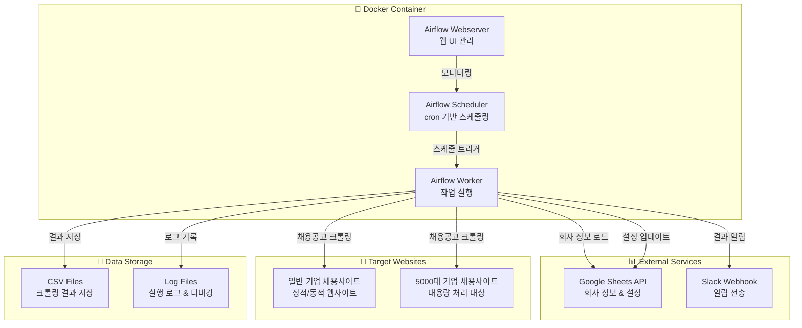
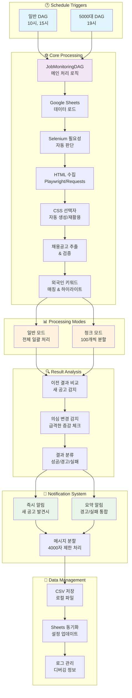
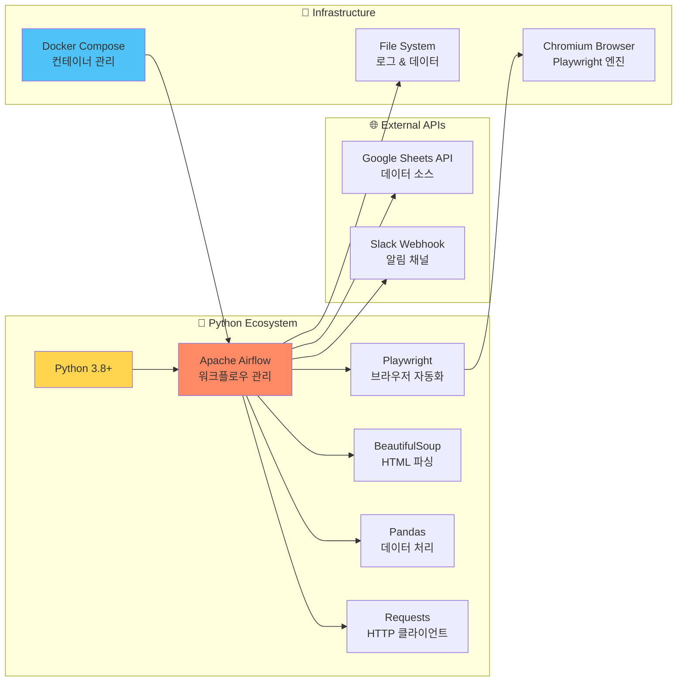

# Job Monitoring System
**기업 채용홈페이지 자동 모니터링 및 Slack 알림 시스템**

## 목차
- [시스템 개요](#시스템-개요)
- [시스템 아키텍처](#시스템-아키텍처)
- [동작 흐름도](#동작-흐름도)
- [프로젝트 구조](#프로젝트-구조)
- [핵심 기능](#핵심-기능)
- [설치 및 설정](#설치-및-설정)
- [운영 가이드](#운영-가이드)
- [기술 문서](#기술-문서)
- [문제해결](#문제해결)

## 시스템 개요

**Job Monitoring System**은 기업 채용홈페이지를 자동으로 모니터링하여 새로운 채용공고를 실시간으로 감지하고 Slack으로 알림을 보내는 완전 자동화 시스템입니다.

### 주요 특징
- **지능형 크롤링**: 동적/정적 웹사이트를 자동으로 구분하여 최적화된 방법으로 크롤링
- **패턴 기반 선택자 생성**: 채용공고 영역을 자동으로 감지하는 CSS 선택자 생성
- **대용량 처리**: 5000대 기업을 청크 단위로 안전하게 순차 처리
- **실시간 알림**: 새로운 채용공고 발견 시 Slack으로 즉시 알림
- **웹 기반 관리**: Google Sheets를 통한 중앙화된 설정 관리

### 모니터링 대상
| 대상 | 실행 시간 | 처리 방식 | Slack 채널 |
|------|----------|----------|------------|
| **일반 채용홈페이지** | 매일 10시, 15시 | 전체 일괄 처리 | `SLACK_WEBHOOK_URL` |
| **5000대 기업** | 매일 19시 | 100개씩 청크 처리 | `TOP5000COMPANY_URL` |

## 시스템 아키텍처

### 전체 시스템 구조

```mermaid
graph TB
    subgraph "🐳 Docker Container"
        A[Airflow Scheduler<br/>cron 기반 스케줄링]
        B[Airflow Webserver<br/>웹 UI 관리]
        C[Airflow Worker<br/>작업 실행]
    end

    subgraph "📊 External Services"
        D[Google Sheets API<br/>회사 정보 & 설정]
        E[Slack Webhook<br/>알림 전송]
    end

    subgraph "🏢 Target Websites"
        F[일반 기업 채용사이트<br/>정적/동적 웹사이트]
        G[5000대 기업 채용사이트<br/>대용량 처리 대상]
    end

    subgraph "💾 Data Storage"
        H[CSV Files<br/>크롤링 결과 저장]
        I[Log Files<br/>실행 로그 & 디버깅]
    end

    A --> |스케줄 트리거| C
    C --> |회사 정보 로드| D
    C --> |채용공고 크롤링| F
    C --> |채용공고 크롤링| G
    C --> |결과 알림| E
    C --> |결과 저장| H
    C --> |로그 기록| I
    C --> |설정 업데이트| D
    B --> |모니터링| A
```

### 상세 처리 흐름

```mermaid
graph TD
    subgraph "🕐 Schedule Triggers"
        S1[일반 DAG<br/>10시, 15시]
        S2[5000대 DAG<br/>19시]
    end

    subgraph "⚙️ Core Processing"
        P1[JobMonitoringDAG<br/>메인 처리 로직]
        P2[Google Sheets<br/>데이터 로드]
        P3[Selenium 필요성<br/>자동 판단]
        P4[HTML 수집<br/>Playwright/Requests]
        P5[CSS 선택자<br/>자동 생성/재활용]
        P6[채용공고 추출<br/>& 검증]
        P7[외국인 키워드<br/>매칭 & 하이라이트]
    end

    subgraph "📊 Processing Modes"
        M1[일반 모드<br/>전체 일괄 처리]
        M2[청크 모드<br/>100개씩 분할]
    end

    subgraph "🔍 Result Analysis"
        R1[이전 결과 비교<br/>새 공고 감지]
        R2[의심 변경 감지<br/>급격한 증감 체크]
        R3[결과 분류<br/>성공/경고/실패]
    end

    subgraph "📱 Notification System"
        N1[즉시 알림<br/>새 공고 발견시]
        N2[요약 알림<br/>경고/실패 통합]
        N3[메시지 분할<br/>4000자 제한 처리]
    end

    subgraph "💾 Data Management"
        D1[CSV 저장<br/>로컬 파일]
        D2[Sheets 동기화<br/>설정 업데이트]
        D3[로그 관리<br/>디버깅 정보]
    end

    S1 --> P1
    S2 --> P1
    P1 --> P2
    P2 --> P3
    P3 --> P4
    P4 --> P5
    P5 --> P6
    P6 --> P7

    P7 --> M1
    P7 --> M2

    M1 --> R1
    M2 --> R1
    R1 --> R2
    R2 --> R3

    R3 --> N1
    R3 --> N2
    N1 --> N3
    N2 --> N3

    N3 --> D1
    D1 --> D2
    D2 --> D3

    style S1 fill:#e1f5fe
    style S2 fill:#e1f5fe
    style P1 fill:#f3e5f5
    style M1 fill:#fff3e0
    style M2 fill:#fff3e0
    style N1 fill:#e8f5e8
    style N2 fill:#e8f5e8
```

### 기술 스택 & 의존성

```mermaid
graph LR
    subgraph "🐍 Python Ecosystem"
        PY[Python 3.8+]
        AF[Apache Airflow<br/>워크플로우 관리]
        PW[Playwright<br/>브라우저 자동화]
        BS[BeautifulSoup<br/>HTML 파싱]
        PD[Pandas<br/>데이터 처리]
        RQ[Requests<br/>HTTP 클라이언트]
    end

    subgraph "🌐 External APIs"
        GS[Google Sheets API<br/>데이터 소스]
        SL[Slack Webhook<br/>알림 채널]
    end

    subgraph "🐳 Infrastructure"
        DC[Docker Compose<br/>컨테이너 관리]
        CR[Chromium Browser<br/>Playwright 엔진]
        FS[File System<br/>로그 & 데이터]
    end

    PY --> AF
    AF --> PW
    AF --> BS
    AF --> PD
    AF --> RQ

    AF --> GS
    AF --> SL

    DC --> AF
    PW --> CR
    AF --> FS

    style PY fill:#ffd54f
    style AF fill:#ff8a65
    style DC fill:#4fc3f7
```

## 동작 흐름도

### 1. 전체 시스템 흐름
```
Airflow 스케줄러
    ↓
JobMonitoringDAG 실행
    ↓
Google Sheets 데이터 로드
    ├─ 회사 목록 (URL, 설정)
    └─ 외국인 채용 키워드
    ↓
통합 전처리 & 크롤링
    ├─ Selenium 필요성 자동 판단
    ├─ CSS 선택자 자동 생성/재활용
    ├─ 순차 HTML 수집 (Playwright 컨텍스트 재사용)
    └─ 채용공고 데이터 추출
    ↓
결과 비교 & 분석
    ├─ 새로운 채용공고 감지
    ├─ 외국인 채용공고 필터링
    └─ 의심스러운 변경사항 체크
    ↓
Slack 알림 발송
    ├─ 구조화된 메시지 (텍스트 형식)
    ├─ 회사별 그룹화
    ├─ 외국인 공고 하이라이트
    └─ 시간 정보 포함
    ↓
결과 저장 & 동기화
    ├─ CSV 파일 저장
    └─ Google Sheets 업데이트
```

### 2. 5000대 기업 청크 처리 흐름
```
5000대_기업 시트 로드
    ↓
100개씩 청크 분할
    ↓
각 청크별 처리 Loop
    ├─ 청크 N 처리 시작 로그
    ├─ 통합 전처리 & 크롤링
    ├─ 안전한 중간 저장 (Google Sheets)
    ├─ 실패 정보 수집 (알림 X)
    ├─ 2분 대기 (서버 부하 방지)
    └─ 다음 청크로 이동
    ↓
전체 처리 완료 후
    ├─ 모든 경고사항 수집
    ├─ 모든 실패 정보 수집
    └─ 요약 알림 한번에 발송
    ↓
최종 저장 & 동기화
```

### 3. 개별 회사 처리 상세 흐름
```
회사 정보 입력
    ├─ 회사명, URL, 기존 선택자
    └─ selenium_required 값
    ↓
Selenium 필요성 자동 판단
    ├─ SPA 프레임워크 감지
    ├─ JavaScript 의존도 분석
    └─ 특정 사이트 예외 처리
    ↓
HTML 콘텐츠 수집
    ├─ 정적: requests (빠른 처리)
    └─ 동적: Playwright (브라우저 자동화)
    ↓
CSS 선택자 처리
    ├─ 기존 검증된 선택자 재활용 (20자+ 우선)
    ├─ 새 선택자 자동 생성
    ├─ 채용공고 컨테이너 패턴 탐지
    └─ 가중치 기반 최적 선택자 선택
    ↓
채용공고 데이터 추출
    ├─ 선택자로 요소 추출
    ├─ 텍스트 정제 및 필터링
    ├─ 채용공고 유효성 검증
    └─ 외국인 채용 키워드 매칭
    ↓
결과 반환
    ├─ 성공: 채용공고 목록
    └─ 실패: 오류 정보 및 selenium_required 조정
```

## 상세 로직 흐름

### 1. 시스템 초기화 및 설정 로드

**JobMonitoringDAG 클래스 초기화:**
```python
# job_monitoring_logic.py:22-38
def __init__(self, base_dir, worksheet_name='[등록]채용홈페이지 모음', webhook_url_env='SLACK_WEBHOOK_URL', results_filename='job_postings_latest.csv', limit=None):
    # 1. 환경변수 및 기본 설정 로드
    self.base_dir = base_dir  # 작업 디렉토리
    self.worksheet_name = worksheet_name  # 처리할 시트명
    self.webhook_url = os.getenv(webhook_url_env)  # 슬랙 웹훅 URL
    self.limit = limit  # 테스트용 처리 제한
    self.company_urls = {}
    self.foreign_keywords = []  # 외국인 채용공고 키워드

    # 2. HTTP 세션 설정 (쿠키 및 연결 유지)
    self.session = requests.Session()
    self._setup_session()

    # 3. 로거 설정 (시간, 레벨, 메시지 포맷)
    self._setup_logging()
```

**Google Sheets 연동 초기화:**
```python
# google_sheet_utils.py:7-38
class GoogleSheetManager:
    def __init__(self, base_dir: str):
        self.base_dir = base_dir
        self.sheet_key = os.getenv('GOOGLE_SHEET_KEY')
        self.creds_path = os.path.join(self.base_dir, 'key', 'credentials.json')
        self.logger = logging.getLogger(__name__)
        self.gc = self._authorize()

    def _authorize(self):
        """Google API 인증"""
        scopes = [
            'https://www.googleapis.com/auth/spreadsheets',
            'https://www.googleapis.com/auth/drive'
        ]
        creds = Credentials.from_service_account_file(self.creds_path, scopes=scopes)
        gc = gspread.authorize(creds)
        return gc
```

### 2. 데이터 로드 및 전처리

**Google Sheets에서 회사 목록 로드:**
```python
# job_monitoring_logic.py:82-100
def run(self):
    self.sheet_manager = GoogleSheetManager(self.base_dir)
    self.selenium_checker = SeleniumRequirementChecker()
    self.selector_analyzer = JobPostingSelectorAnalyzer()

    self.logger.info(f"🚀 Job Monitoring DAG 시작 - {self.worksheet_name}")
    df_config = self.sheet_manager.get_all_records_as_df(self.worksheet_name)
    if df_config.empty:
        self.logger.error(f"설정 정보를 가져오지 못했습니다: {self.worksheet_name}")
        return

    if self.limit:
        self.logger.info(f"테스트 목적으로 {self.limit}개 기업만 처리합니다.")
        df_config = df_config.head(self.limit)

    # 외국인 채용 키워드 시트 로드
    keyword_sheets = ['5000대_기업', '[등록]채용홈페이지 모음']
    if self.worksheet_name in keyword_sheets:
        # 외국인 채용공고 키워드 로드
        ...
```

### 3. Selenium 필요성 자동 판단

**동적/정적 웹사이트 판단 로직:**
```python
# utils.py:44-137 - SeleniumRequirementChecker 클래스
class SeleniumRequirementChecker:
    """채용공고 URL에 대해 Selenium 필요 여부를 판별하는 클래스"""

    def check_selenium_requirement(self, url: str, selector: Optional[str] = None) -> bool:
        """URL과 CSS 선택자를 기준으로 Selenium 필요 여부를 판별"""
        try:
            response = requests.get(url, headers=self.headers, timeout=self.timeout)
            soup = BeautifulSoup(response.text, 'html.parser')

            # 사이트별 특수 처리
            if "greetinghr.com" in url:
                return self._check_greetinghr(url, soup)

            return self._check_general_selector(url, selector, soup)
        except:
            return True  # 접근 실패시 Selenium 사용

    def _is_spa_site(self, soup: BeautifulSoup) -> bool:
        """SPA(Single Page Application) 사이트인지 감지"""
        # 1. React/Next.js/Vue 등의 SPA 지표 감지
        strong_spa_indicators = [
            '__next', 'buildId', '__NEXT_DATA__',  # Next.js
            'reactroot', 'react-root',              # React
            '__vue__', '__nuxt__',                  # Vue/Nuxt
            'ng-app', 'ng-version'                  # Angular
        ]

        html_content = str(soup).lower()
        body = soup.find('body')
        body_text = body.get_text(strip=True) if body else ""

        # 2. SPA 지표 + 적은 body 텍스트 = SPA
        if any(ind in html_content for ind in strong_spa_indicators) and len(body_text) < 500:
            return True

        # 3. 극도로 적은 body 내용 + 많은 스크립트 = SPA
        scripts = soup.find_all('script')
        if len(body_text) < 50 and len(scripts) > 5:
            return True

        return False

# job_monitoring_logic.py:1187-1197 - 위 클래스 사용
def _determine_selenium_requirement(self, url: str, _: str) -> int:
    """URL을 기반으로 Selenium 필요 여부를 동적으로 판단"""
    selenium_req = self.selenium_checker.check_selenium_requirement(url)
    return int(selenium_req)  # True=1(Selenium), False=0(requests)
```

### 4. HTML 콘텐츠 수집

**동적/정적 방식 자동 선택:**
```python
# job_monitoring_logic.py:1317-1436
def get_html_content_for_crawling_with_browser(self, url, use_selenium, context=None, selector=None):
    """실제 크롤링용 HTML 가져오기 (Playwright 컨텍스트 재사용)"""
    # URL별 타임아웃 설정
    if 'toss.im' in url:
        page_timeout = 60000  # 60초
        wait_time = 3
    else:
        page_timeout = 20000  # 20초
        wait_time = 1

    if not use_selenium:
        # 정적 사이트: requests로 빠르게 처리
        headers = {
            'User-Agent': 'Mozilla/5.0 (Macintosh; Intel Mac OS X 10_15_7) ...',
            'Accept': 'text/html,application/xhtml+xml,...',
            ...
        }
        response = requests.get(url, headers=headers, timeout=20, verify=False)
        return response.text
    else:
        # 동적 사이트: Playwright 브라우저 사용
        # 컨텍스트가 전달되었으면 재사용, 없으면 새로 생성
        should_close_context = False
        if not context:
            playwright, browser, context = self.create_playwright_browser()
            should_close_context = True

        page = context.new_page()
        page.goto(url, timeout=page_timeout)

        # 선택자가 있으면 해당 요소 대기
        if selector:
            page.wait_for_selector(selector, timeout=page_timeout // 2)

        time.sleep(wait_time)
        html_content = page.content()
        page.close()  # 페이지만 닫기 (컨텍스트는 유지)

        return html_content

def get_html_content_for_crawling(self, url, use_selenium, selector=None):
    """실제 크롤링용 HTML 가져오기 메서드 (하위 호환성 유지)"""
    return self.get_html_content_for_crawling_with_browser(url, use_selenium, None, selector)
```

### 5. CSS 선택자 생성 및 검증

**기존 선택자 재활용 우선 로직:**
```python
# job_monitoring_logic.py:657-714
def _process_company_complete(self, args):
    """선택자 찾기와 공고 수집을 한번에 처리"""
    index, row, existing_selectors = args
    company_name = row['회사_한글_이름']
    url = row['job_posting_url']
    selector = row.get('selector', '')
    use_selenium = row['selenium_required']

    self.company_urls[company_name] = url
    html_content = self.get_html_content_for_crawling(url, use_selenium)

    if not html_content:
        return index, None, None, {'company': company_name, 'reason': 'HTML 가져오기 실패', 'url': url, 'selenium_status': -1}

    soup = BeautifulSoup(html_content, 'html.parser')

    # 1. 선택자가 없거나 빈 경우 새로 찾기
    if not selector or selector.strip() == '':
        # 기존 선택자들 중 작동하는 것 찾기
        found_selector = self._try_existing_selectors(soup, existing_selectors, company_name)

        if found_selector:
            selector = found_selector
        else:
            # 새 선택자 자동 생성
            best_selector, _ = self.selector_analyzer.find_best_selector(soup)
            if best_selector:
                selector = best_selector
            else:
                return index, None, None, {'company': company_name, 'reason': '선택자를 찾을 수 없음', 'url': url, 'selenium_status': -2}

    # 2. 선택자로 채용공고 추출
    postings = soup.select(selector)
    all_texts = [post.get_text(strip=True) for post in postings]
    job_titles = {text for text in all_texts if self.selector_analyzer._is_potential_job_posting(text)}

    if job_titles:
        return index, selector, job_titles, None
    else:
        return index, selector, None, {'company': company_name, 'reason': '유효한 공고를 찾지 못함', 'url': url}
```

**새 CSS 선택자 자동 생성:**
```python
# analyze_titles.py:9-63 - 클래스 초기화
class JobPostingSelectorAnalyzer:
    """채용공고 선택자 분석기"""
    def __init__(self):
        self.job_keywords = [
            '개발자', '엔지니어', '디자이너', '기획자', '매니저', 'PM', '팀장', '전문가',
            'developer', 'engineer', 'designer', 'manager', 'planner', 'lead',
            '채용', '인턴', '신입', '경력', '정규직', '계약직'
        ]
        self.blacklist = ['nav', 'footer', 'header', 'menu', 'sitemap', 'aside', 'sidebar']

    def _is_potential_job_posting(self, text: str) -> bool:
        """텍스트가 채용공고일 가능성을 판단"""
        if not (3 <= len(text) <= 150):
            return False

        # 회사명 패턴 제외
        company_patterns = [
            r'^(건설기계|HD현대\w*|삼성\w*|LG\w*|SK\w*|포스코\w*|롯데\w*|...)$',
            ...
        ]

        # UI 요소 제외
        datetime_patterns = [r'^D-\d+.*$', r'^#[^#]+(\s+외\s*\d+)?$', ...]

        return True  # 모든 필터 통과시

# analyze_titles.py:349-500 - 최적 선택자 찾기
def find_best_selector(self, soup: BeautifulSoup) -> Tuple[Optional[str], List[str]]:
    # 1. 구체적인 채용공고 컨테이너 우선 찾기
    specific_containers = self._find_job_posting_containers(soup)
    if specific_containers:
        best_container = max(specific_containers, key=lambda x: len(x[1]))
        if len(best_container[1]) >= 1:
            return best_container[0], best_container[1]

    # 2. 링크 텍스트 기반 검색
    link_elements = []
    for link in soup.find_all('a', href=True):
        # 블랙리스트 영역 제외
        if any(parent.name in self.blacklist for parent in link.find_parents()):
            continue
        text = link.get_text(strip=True)
        if self._is_potential_job_posting(text) and len(text) > 5:
            link_elements.append(link)

    # 3. 가중치 기반 부모 컨테이너 선택
    parent_scores = {}
    for element in link_elements:
        text = element.get_text(strip=True)
        weight = self._calculate_job_posting_weight(text)
        for parent in element.find_parents(limit=3):
            parent_scores[parent] = parent_scores.get(parent, 0) + weight

    # 4. 최적 컨테이너에서 구체적인 선택자 생성
    container = max(parent_scores.items(), key=lambda x: x[1])[0]
    # ... 선택자 생성 로직 ...
    return final_selector, job_titles
```

### 6. 채용공고 데이터 추출 및 검증

**HTML에서 채용공고 추출 (통합 처리):**
```python
# job_monitoring_logic.py:696-710 (_process_company_complete 내부)
# 선택자로 채용공고 추출
postings = soup.select(selector)
all_texts = [post.get_text(strip=True) for post in postings if post.get_text(strip=True).strip()]

# analyze_titles.py의 _is_potential_job_posting 사용하여 채용공고 필터링
job_titles = {text for text in all_texts if self.selector_analyzer._is_potential_job_posting(text)}

# analyze_titles.py:64-100 - 채용공고 유효성 검증
def _is_potential_job_posting(self, text: str) -> bool:
    """텍스트가 채용공고일 가능성을 판단"""
    # 1. 길이 체크 (3~150자)
    if not (3 <= len(text) <= 150):
        return False

    # 2. 회사명 패턴 제외 (HD현대, 삼성, LG 등)
    company_name_patterns = [
        r'^(HD현대\w*|삼성\w*|LG\w*|SK\w*|포스코\w*|롯데\w*|한화\w*|...)$',
    ]
    for pattern in company_name_patterns:
        if re.search(pattern, text, re.IGNORECASE):
            return False

    # 3. 날짜/시간/태그 패턴 제외
    datetime_and_ui_patterns = [
        r'^\d{4}\.\d{2}\.\d{2}.*$',  # 날짜 패턴
        r'^D-\d+.*$',                 # D-day 패턴
        r'^#[^#]+(\s+외\s*\d+)?$',    # 태그 패턴
    ]
    for pattern in datetime_and_ui_patterns:
        if re.search(pattern, text, re.IGNORECASE):
            return False

    return True
```

### 7. 외국인 채용공고 키워드 매칭

**키워드 하이라이트 처리:**
```python
# job_monitoring_logic.py:585-654
def _highlight_foreign_keywords(self, job_title: str) -> Tuple[str, bool]:
    """채용공고 제목에서 외국인 키워드를 볼드처리하고, 외국인 공고인지 여부를 반환"""
    if not self.foreign_keywords:
        return job_title, False

    is_foreign = False

    # 1단계: 이미 *로 둘러싸인 부분 찾기 (보호)
    markdown_ranges = []
    for match in re.finditer(r'\*[^*]+\*', job_title):
        markdown_ranges.append((match.start(), match.end()))

    # 2단계: 키워드 찾기 (보호된 영역 제외)
    matches = []
    for keyword in self.foreign_keywords:
        for match in re.finditer(re.escape(keyword), job_title, re.IGNORECASE):
            start, end = match.start(), match.end()

            # 이미 마크다운으로 처리된 영역과 겹치는지 확인
            overlap = any(not (end <= md_start or start >= md_end)
                         for md_start, md_end in markdown_ranges)

            if not overlap:
                matches.append((start, end))
                is_foreign = True

    if not is_foreign:
        return job_title, False

    # 3단계: 매칭된 위치들을 병합 (중첩 제거)
    matches.sort()
    merged = [matches[0]]
    for current_start, current_end in matches[1:]:
        last_start, last_end = merged[-1]
        if current_start <= last_end:
            merged[-1] = (last_start, max(last_end, current_end))
        else:
            merged.append((current_start, current_end))

    # 4단계: 볼드 처리된 새로운 문자열 생성
    highlighted_title = ""
    last_index = 0
    for start, end in merged:
        highlighted_title += job_title[last_index:start]
        highlighted_title += f"*{job_title[start:end]}*"
        last_index = end
    highlighted_title += job_title[last_index:]

    # 외국인 공고인 경우 크리스탈볼 이모지 추가
    if is_foreign:
        highlighted_title = f"🔮 {highlighted_title}"

    return highlighted_title, is_foreign
```

### 8. 결과 비교 및 새 공고 감지

**이전 결과와 비교 로직:**
```python
# job_monitoring_logic.py:1602-1632
def find_new_jobs(self, current_jobs: Dict, existing_jobs: Dict) -> Dict[str, List[str]]:
    """현재 크롤링 결과와 이전 결과를 비교하여 새 공고 감지"""
    new_jobs = {}
    for comp, curr in current_jobs.items():
        if curr is None:
            curr = []
        # list나 set을 모두 set으로 변환하여 비교
        curr_set = set(curr) if not isinstance(curr, set) else curr
        existing_set = existing_jobs.get(comp, set())

        # 집합 차연산으로 새 공고 찾기
        new_jobs_for_company = list(curr_set - existing_set)
        if new_jobs_for_company:
            new_jobs[comp] = new_jobs_for_company
    return new_jobs

def check_suspicious_results(self, current_jobs: Dict, existing_jobs: Dict, new_jobs: Dict) -> List[str]:
    """의심스러운 변경사항 감지"""
    warnings = []
    for company, new_list in new_jobs.items():
        existing_count = len(existing_jobs.get(company, set()))
        current_jobs_data = current_jobs.get(company, [])
        current_count = len(current_jobs_data) if isinstance(current_jobs_data, (list, set)) else 0

        # 기존 공고가 모두 사라지고 새로운 공고만 보이는 경우
        if existing_count > 0 and len(new_list) == current_count:
            warnings.append(f"{company}: 기존 공고가 모두 사라지고 새로운 공고만 보입니다. 홈페이지를 직접 확인해주세요.")
    return warnings
```

### 9. Slack 메시지 생성 및 전송

**텍스트 기반 Slack 메시지 전송:**
```python
# job_monitoring_logic.py:1693-1800
def send_slack_notification(self, new_jobs: Dict, warnings: List, failed_companies: List, chunk_info: str = None):
    """Slack 알림 메시지 전송"""
    if not self.webhook_url:
        self.logger.error(f"❌ 웹훅 URL 없음: {self.webhook_url_env}이 .env에 설정되지 않았습니다.")
        return

    if not new_jobs and not warnings and not failed_companies:
        return

    kst = pytz.timezone('Asia/Seoul')
    current_time = datetime.now(kst).strftime('%H:%M')
    weekdays = ['월', '화', '수', '목', '금', '토', '일']
    current_datetime = datetime.now(kst)
    formatted_datetime = f"{current_datetime.month}월 {current_datetime.day}일 ({weekdays[current_datetime.weekday()]}) {current_datetime.strftime('%H:%M')}"

    def sanitize_slack_text(text: str) -> str:
        """슬랙 메시지용 텍스트를 안전하게 처리"""
        text = text.replace('\\', '\\\\').replace('"', '\\"')
        # 닫히지 않은 마크다운 수정
        if text.count('*') % 2 == 1:
            text += '*'
        if len(text) > 2900:
            text = text[:2900] + "..."
        return text

    def create_unified_message():
        """통합 메시지 생성"""
        content_sections = []

        # 요약 헤더 생성
        total_new_jobs = sum(len(jobs) for jobs in new_jobs.values()) if new_jobs else 0
        foreign_job_count = sum(1 for jobs in new_jobs.values() for job in jobs if self._is_foreign_job_posting(job)) if new_jobs else 0

        summary_parts = []
        if total_new_jobs > 0:
            foreign_info = f" (외국인 채용: {foreign_job_count}개 🔮)" if foreign_job_count > 0 else ""
            summary_parts.append(f"새로운 공고: {total_new_jobs}개{foreign_info}")
        if warnings:
            summary_parts.append(f"홈페이지 확인: {len(warnings)}개")
        if failed_companies:
            summary_parts.append(f"실패: {len(failed_companies)}개")

        chunk_str = f"({chunk_info}) " if chunk_info else ""
        summary = " | ".join(summary_parts)
        header = f":robot_face: *채용공고 모니터링 결과* {chunk_str}({current_time})\n*{summary}*"

        # 회사별 채용공고 섹션 생성
        if new_jobs:
            for company, jobs in new_jobs.items():
                url = self.company_urls.get(company, "")
                linked_company = f"<{url}|{company}>" if url else f"*{company}*"
                job_lines = [f"  • {self._highlight_foreign_keywords(job)[0]}" for job in jobs]
                content_sections.append(f"📢 {linked_company} - {formatted_datetime} ({len(jobs)}개)\n" + "\n".join(job_lines))

        return header, content_sections

    # 메시지 생성 및 전송
    header, sections = create_unified_message()
    full_message = header + "\n\n" + "\n\n".join(sections)
    payload = {"text": sanitize_slack_text(full_message), "username": "채용공고 알리미", "icon_emoji": ":robot_face:"}
    requests.post(self.webhook_url, json=payload, timeout=15)
```

### 10. 데이터 저장 및 동기화

**결과 저장 및 Google Sheets 업데이트:**
```python
# job_monitoring_logic.py:1634-1672
def save_jobs(self, current_jobs: Dict):
    """크롤링 결과를 CSV 파일로 저장"""
    kst = pytz.timezone('Asia/Seoul')
    current_time_kst = datetime.now(kst)

    all_postings = [
        {'회사_한글_이름': comp, 'job_posting_title': title, 'crawl_datetime': current_time_kst.strftime('%Y-%m-%d %H:%M:%S')}
        for comp, titles in current_jobs.items()
        for title in titles
    ]

    try:
        pd.DataFrame(all_postings).to_csv(self.results_path, index=False, encoding='utf-8-sig')
        self.logger.info(f"결과를 '{self.results_path}'에 저장했습니다.")
    except PermissionError as e:
        # 대안 경로 시도
        import tempfile
        temp_path = os.path.join(tempfile.gettempdir(), 'job_postings_latest.csv')
        pd.DataFrame(all_postings).to_csv(temp_path, index=False, encoding='utf-8-sig')
        self.logger.info(f"임시 경로에 결과를 저장했습니다: '{temp_path}'")

def save_jobs_incrementally(self, current_jobs: Dict, append: bool):
    """결과를 CSV 파일에 증분 저장"""
    kst = pytz.timezone('Asia/Seoul')
    current_time_kst = datetime.now(kst)
    all_postings = [{'회사_한글_이름': comp, 'job_posting_title': title, 'crawl_datetime': current_time_kst.strftime('%Y-%m-%d %H:%M:%S')} for comp, titles in current_jobs.items() for title in titles]

    if not all_postings:
        return

    df_to_save = pd.DataFrame(all_postings)
    mode = 'a' if append else 'w'
    header = not append
    df_to_save.to_csv(self.results_path, mode=mode, header=header, index=False, encoding='utf-8-sig')

# google_sheet_utils.py:60-79
def update_sheet_from_df(self, df: pd.DataFrame, sheet_name: str = None):
    """DataFrame의 데이터로 시트 전체를 업데이트"""
    spreadsheet = self.gc.open_by_key(self.sheet_key)
    worksheet = spreadsheet.worksheet(sheet_name) if sheet_name else spreadsheet.sheet1

    # 기존 데이터 삭제 후 DataFrame으로 업데이트
    worksheet.clear()
    worksheet.update([df.columns.values.tolist()] + df.values.tolist())
    self.logger.info(f"✅ '{worksheet.title}' 시트 업데이트 성공")
```

## 프로젝트 구조

```
job-monitoring/
├── src/                              # 핵심 소스코드 (8개 파일)
│   ├── job_monitoring_logic.py       # 메인 크롤링 로직 (1930줄)
│   ├── job_monitoring_airflow_dag.py # Airflow 스케줄링 정의 (74줄)
│   ├── analyze_titles.py             # 선택자 패턴 분석기 (728줄)
│   ├── google_sheet_utils.py         # Google Sheets 연동 (209줄)
│   ├── utils.py                      # 유틸리티 함수들 (136줄)
│   ├── test_cpu_fix_dag.py           # CPU 문제 해결 테스트 DAG (87줄)
│   ├── test_job_monitoring_100_dag.py # 100개 기업 테스트 DAG (50줄)
│   └── weekly_dashboard_dag.py       # 주간 대시보드 DAG (99줄)
├── data/                             # 데이터 저장소
│   ├── job_postings_latest.csv       # 일반 모니터링 결과
│   └── top_5000_postings_latest.csv  # 5000대 기업 결과
├── logs/                             # Airflow 실행 로그
│   ├── dag_id=job_monitoring_dag/
│   ├── dag_id=top5000_company_monitoring_dag/
│   └── scheduler/
├── key/                              # 인증 파일
│   └── credentials.json              # Google API 서비스 계정 키
├── scripts/                          # 배포 자동화
│   ├── lambda_function.py            # AWS Lambda 함수
│   └── setup-aws-automation.sh       # AWS 환경 설정
├── archive_temp/                     # 디버깅 스크립트 보관소
├── docker-compose.yml                # Docker 컨테이너 설정
├── Dockerfile                        # Docker 이미지 정의
├── requirements.txt                  # Python 의존성
└── .env                              # 환경변수 설정
```

## 핵심 기능

### 1. 지능형 웹사이트 분석

**동적/정적 웹사이트 자동 구분:**
- SPA(React, Vue, Next.js) 프레임워크 자동 감지
- JavaScript 의존도 분석으로 렌더링 방식 결정
- requests 실패 시 Playwright로 자동 전환
- 사이트별 맞춤 최적화 로직

**CSS 선택자 자동 생성:**
- 기존 검증된 선택자 재활용 우선 (20자 이상)
- 채용공고 컨테이너 패턴 인식 (job, recruit, career)
- 가중치 기반 최적 선택자 선택
- UI 요소 제외 필터 (네비게이션, 푸터, 광고)

### 2. 안정적인 순차 처리

**순차적 크롤링:**
- 메모리 사용량 최적화된 순차 처리
- Selenium 필요성 판단과 크롤링 순차 실행
- 청크 단위 처리로 시스템 안정성 확보

**안전한 대용량 처리:**
- 5000대 기업을 100개씩 청크 분할
- 청크 간 2분 대기로 서버 부하 방지
- 중간 실패 시에도 처리 계속 및 복구

### 3. 스마트 알림 시스템

**외국인 채용공고 필터링:**
- Google Sheets 기반 키워드 관리
- 실시간 키워드 하이라이트 (`*키워드*`)
- 기존 볼드체와의 중복 방지 로직
- 이모지로 시각적 구분

**구조화된 Slack 메시지:**
- 텍스트 기반 가독성 높은 메시지 (Block Kit 호환성 이슈로 변경)
- 회사명 클릭 시 채용 페이지 이동
- 한국 시간 기준 상세 시간 정보
- 실패 원인과 해결 방법 안내

### 4. 데이터 관리 및 모니터링

**Google Sheets 중앙 관리:**
- 웹 기반 회사 정보 관리
- 실시간 설정 변경 반영
- 헤더 보존 안전한 업데이트
- 대용량 데이터 배치 처리

**결과 추적 및 분석:**
- 이전 결과와 자동 비교
- 의심스러운 변경사항 감지 (기존 공고 모두 사라진 경우)
- CSV 기반 이력 관리
- 성과 로그 자동 기록

## 설치 및 설정

### 1. 시스템 요구사항
```bash
# Python 3.8+ 필수
python --version  # 3.8 이상 확인

# Docker & Docker Compose
docker --version
docker-compose --version
```

### 2. 프로젝트 설정
```bash
# 1. 저장소 클론
git clone https://github.com/your-repo/kowork-scaper.git
cd kowork-scaper

# 2. 환경변수 설정
cp .env.example .env
# .env 파일 편집하여 실제 값 입력
```

### 3. 환경변수 설정 (.env)
```env
# Airflow 설정
AIRFLOW_UID=50000

# Google Sheets API
GOOGLE_SHEET_KEY=your_sheet_key_here

# Slack Webhook URLs
SLACK_WEBHOOK_URL=https://hooks.slack.com/services/YOUR_WEBHOOK
TOP5000COMPANY_URL=https://hooks.slack.com/services/YOUR_TOP5000_WEBHOOK

# 성능 설정
# MAX_WORKERS 설정 제거됨 (순차 처리로 변경)
```

### 4. Google API 설정
1. [Google Cloud Console](https://console.cloud.google.com/)에서 새 프로젝트 생성
2. Google Sheets API 활성화
3. 서비스 계정 생성 및 JSON 키 다운로드
4. 키 파일을 `key/credentials.json`에 저장
5. 서비스 계정 이메일을 Google Sheets에 편집자로 추가

### 5. Docker 실행
```bash
# 컨테이너 빌드 및 실행
docker-compose up -d

# 실행 상태 확인
docker-compose ps

# 웹 UI 접속: http://localhost:8080
# 기본 계정: admin / admin
```

## 운영 가이드

### 일상 운영 체크리스트

**시스템 상태 확인:**
```bash
# 컨테이너 상태
docker-compose ps

# 실시간 로그 모니터링
docker-compose logs -f webserver scheduler

# 디스크 사용량
du -sh data/ logs/
```

**DAG 관리 (Airflow Web UI):**
- DAG 실행 상태: Success/Failed/Running 확인
- 실행 시간 모니터링: 일반 30분, 5000대 기업 2시간 이내
- 수동 실행 시: `Trigger DAG` 버튼 사용

### Google Sheets 설정 관리

**시트 구조:**
| 컬럼명 | 설명 | 예시 |
|--------|------|------|
| `회사_한글_이름` | 회사명 | `삼성전자` |
| `job_posting_url` | 채용 페이지 URL | `https://company.com/careers` |
| `selector` | CSS 선택자 (자동생성) | `div.job-list a.job-title` |
| `selenium_required` | 크롤링 방식 | `0`: requests, `1`: Selenium, `-1`: 실패 |

**새 회사 추가 방법:**
1. Google Sheets에서 새 행 추가
2. `회사_한글_이름`과 `job_posting_url`만 입력
3. `selector`와 `selenium_required`는 빈 값으로 두기 (자동 생성)
4. 다음 실행 시 자동으로 값 설정됨

### 문제 상황별 대응

**`selenium_required` 값 의미:**
- `0`: requests 방식으로 정상 크롤링 가능
- `1`: Selenium 브라우저 자동화 필요 (SPA 사이트)
- `-1`: HTML 가져오기 실패 (접근 차단, 네트워크 오류)
- `-2`: 선택자 생성 실패 (채용공고 영역 찾을 수 없음)

**문제 해결 단계:**
1. **`-1` 오류**: URL 유효성 확인, 사이트 접근성 체크
2. **`-2` 오류**: 사이트 구조 변경 확인, 수동 선택자 입력 고려
3. **중복/누락**: 해당 회사 `selector` 값 삭제하여 재생성 유도

## 기술 문서

### 핵심 클래스 상세 설명

#### JobMonitoringDAG 클래스
**역할**: 전체 모니터링 프로세스 관리 및 조율

**주요 메서드:**
- `run()`: 메인 실행 로직, DAG별 처리 방식 분기
- `process_companies_integrated()`: 전처리와 크롤링을 통합한 고효율 처리
- `_process_company_complete()`: 개별 회사의 선택자 찾기와 크롤링을 동시 처리
- `get_html_content_for_crawling()`: Playwright/requests 방식을 자동 선택하여 HTML 수집
- `send_slack_notification()`: 외국인 키워드 하이라이트 포함 구조화된 알림 발송

#### JobPostingSelectorAnalyzer 클래스
**역할**: 채용공고 영역 자동 탐지 및 CSS 선택자 생성

**패턴 분석 알고리즘:**
1. 채용공고 전용 컨테이너 우선 탐지 (job, recruit, career 키워드)
2. 직무 관련 텍스트 필터링 (개발자, 엔지니어, 디자이너 등)
3. UI 요소 제외 (네비게이션, 푸터, 날짜 등)
4. 가중치 기반 선택자 품질 평가

#### GoogleSheetManager 클래스
**역할**: Google Sheets와의 실시간 데이터 동기화

**동기화 전략:**
- 서비스 계정 기반 안전한 인증
- 헤더 보존하면서 데이터만 업데이트
- 대용량 데이터 배치 처리 최적화

### 성능 최적화 설정

**처리 방식 변경:**
```python
# 순차 처리로 변경됨 - MAX_WORKERS 설정 불필요
# 메모리 사용량과 시스템 안정성 최적화
```

**청크 크기 조정:**
```python
# src/job_monitoring_logic.py 106라인
chunk_size = 100  # 메모리와 안정성 고려하여 50-150 범위에서 조정
```

**대기 시간 조정:**
```python
# src/job_monitoring_logic.py 145라인
time.sleep(120)  # 서버 부하에 따라 60-300초 범위에서 조정
```

## 문제해결

### 자주 발생하는 문제

#### Docker 관련 문제
```bash
# 컨테이너 재시작
docker-compose down
docker-compose up -d --build

# 포트 충돌 해결
lsof -i :8080  # 사용 중인 프로세스 확인
```

#### 크롤링 관련 문제
- **접근 차단**: User-Agent 변경, 요청 간격 증가
- **선택자 실패**: 사이트 구조 변경 확인, Google Sheets에서 selector 값 삭제
- **성능 저하**: chunk_size 조정, 대기 시간 증가

#### Google Sheets 연동 문제
```bash
# 인증 오류
ls -la key/credentials.json  # 파일 존재 확인
# Google Cloud Console에서 서비스 계정 권한 확인

# API 할당량 초과
# Google Cloud Console -> APIs & Services -> Quotas에서 확인
```

---

## 트러블슈팅 문서

자세한 문제 해결 기록은 `docs/` 폴더 참고:
- `docs/TROUBLESHOOTING_2025-12-29.md` - 메모리 부족, DAG 실행 문제, 슬랙 알림 형식
- `docs/TROUBLESHOOTING_2025-12-31.md` - signal/ThreadPoolExecutor/greenlet 스레드 문제

---

**시스템 버전**: v2.6.0
**문서 업데이트**: 2025년 12월 31일
**최근 변경**: signal.alarm() 제거, ThreadPoolExecutor 제거 (Playwright 스레드 호환성)
